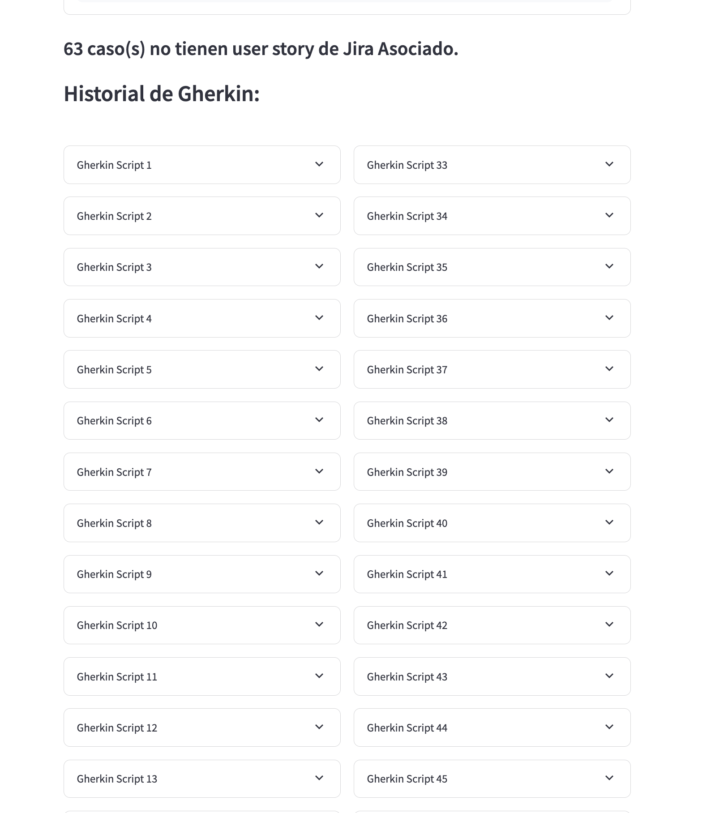
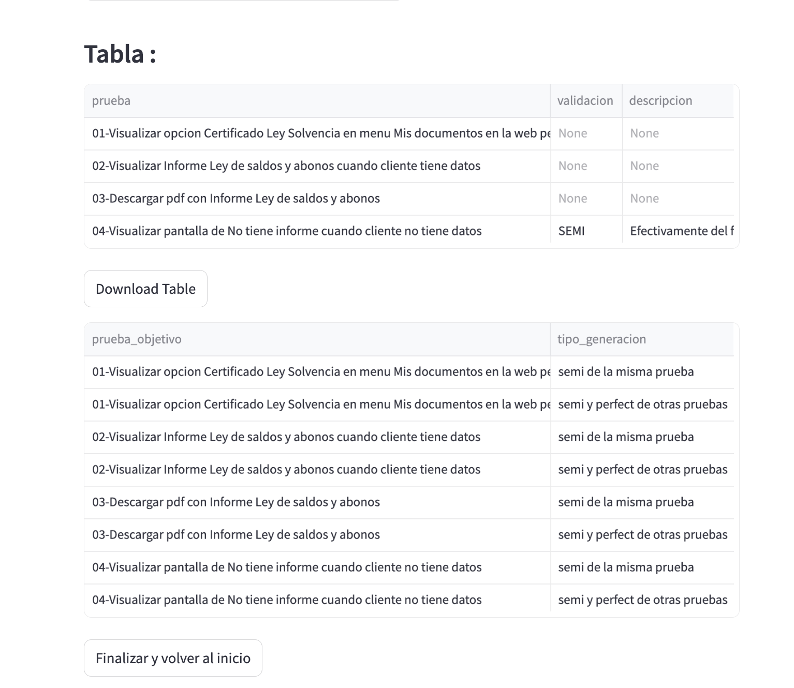

# SDM : Cómo usar la App

Esta aplicación de Streamlit está diseñada para la consulta de Historias de Usuario y se estructura en tres fases principales: **Inicio**, **Editar** y **Procesar**.

## Fase 1: Inicio

Para comenzar a utilizar la app, selecciona en la barra lateral el motor con el que trabajarás: **JIRA** o **SDM**. Al elegir **SDM**, se activan opciones adicionales específicas para este motor:

- Aparecerá un **option box** donde podrás elegir entre dos modalidades de consulta:
  - **Historia de Usuario**:  
    Este flujo es similar al de JIRA. Ingresarás el código correspondiente y utilizarás la matriz de pruebas para buscar coincidencias.
    
  - **Subir M01 y D01**:  
    En este flujo, deberás cargar dos archivos específicos:
    - Uno para **M01**
    - Otro para **D01**
    
    Adicionalmente, se requerirá la carga de la **matriz de pruebas** que se usará para trabajar con la información contenida en dichos archivos.

La interfaz se adaptará según la opción seleccionada; en el caso de “Historia de Usuario” se mostrarán los campos de entrada habituales, mientras que para “Subir M01 y D01” se habilitarán dos upload boxes separados para cada archivo, junto con el campo para la matriz de pruebas.

## Fase 2: Editar

En esta fase, se mostrará la información consultada:

- Si elegiste **Historia de Usuario**, verás la descripción obtenida para el código ingresado, similar al flujo en JIRA.
- Si optaste por **Subir M01 y D01**, se presentará la información extraída de ambos archivos, procesada junto con la matriz de pruebas.

En ambos casos, se mostrará una tabla editable de componentes funcionales. Revisa la información y, de ser necesario, modifícala. Cuando estés listo, haz clic en el botón **Continuar** para proceder a la siguiente fase.

## Fase 3: Procesar

Una vez finalizado el procesamiento, la app desplegará los siguientes resultados:

- El **historial de scripts Gherkin** generados.
- Las **tablas de resultados** correspondientes a la ejecución de estos scripts.

Podrás visualizar el código completo de cada script expandiendo los detalles a través de los expander correspondientes.

Al hacer clic en los expander, se desplegará el código del script:

Finalmente, se mostrarán las tablas con los resultados obtenidos:

