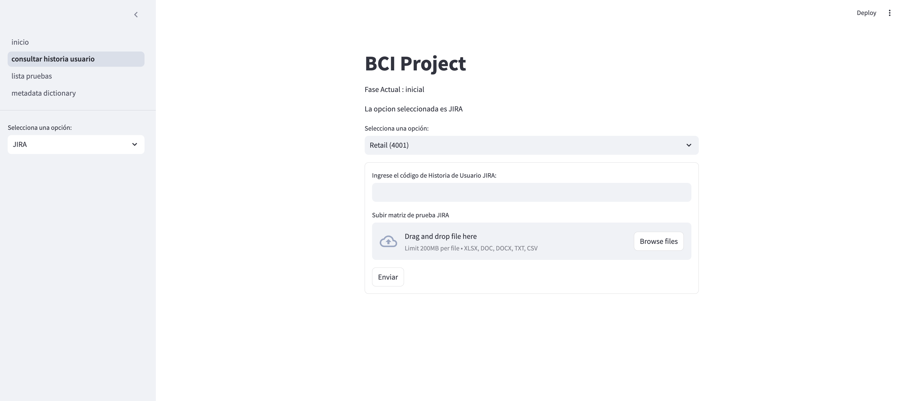
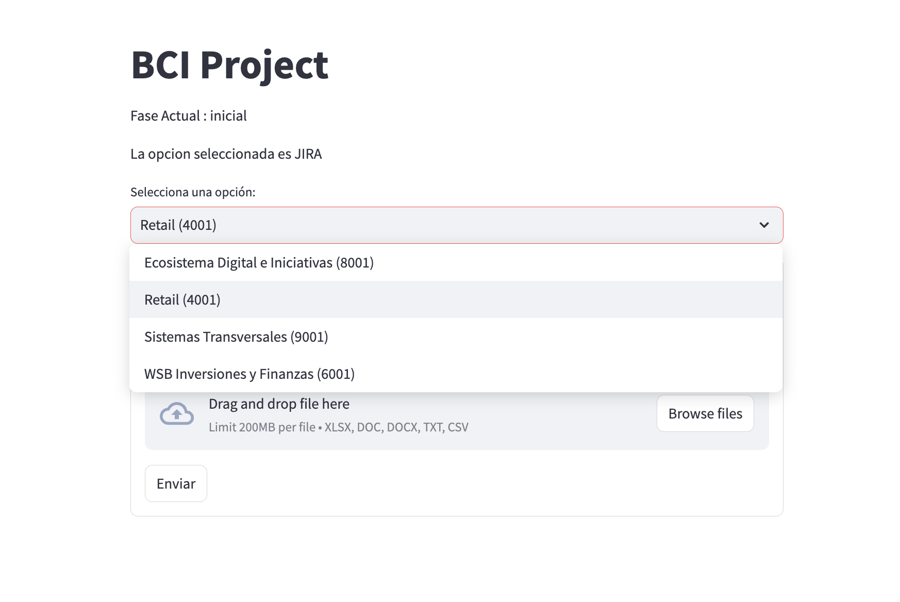
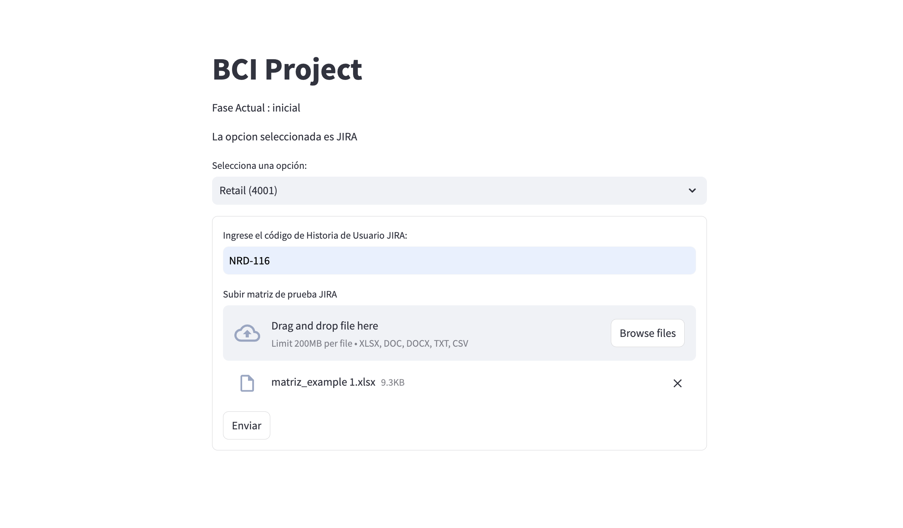
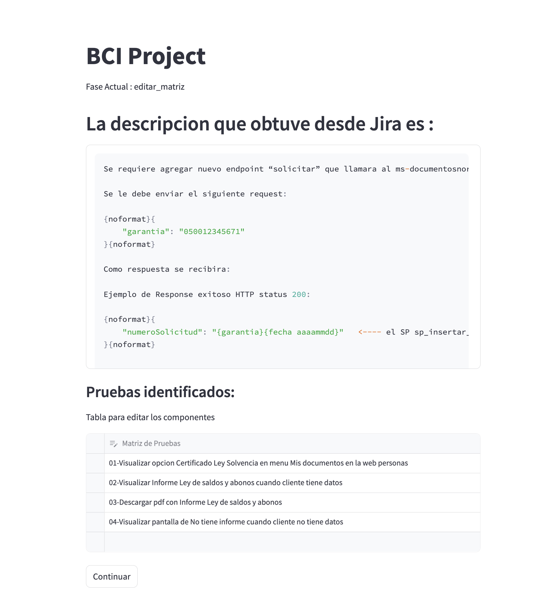
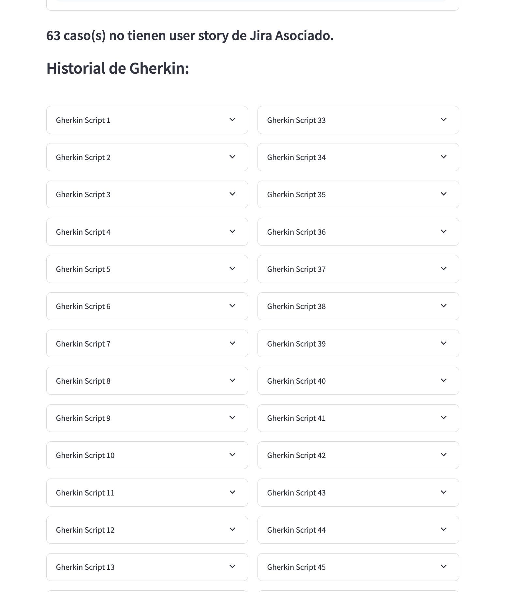
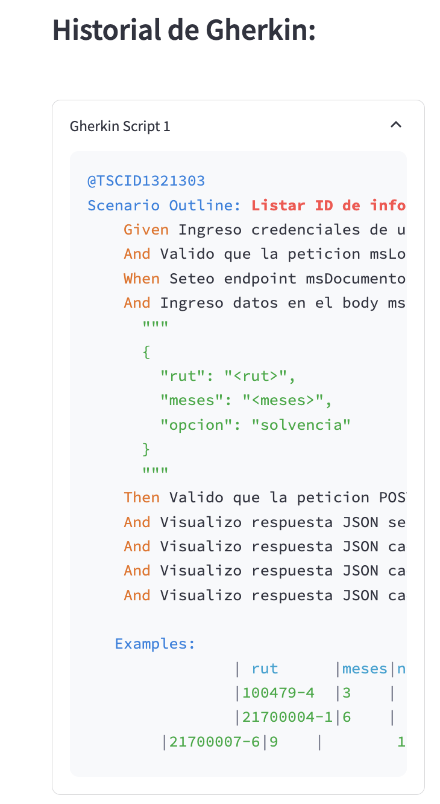
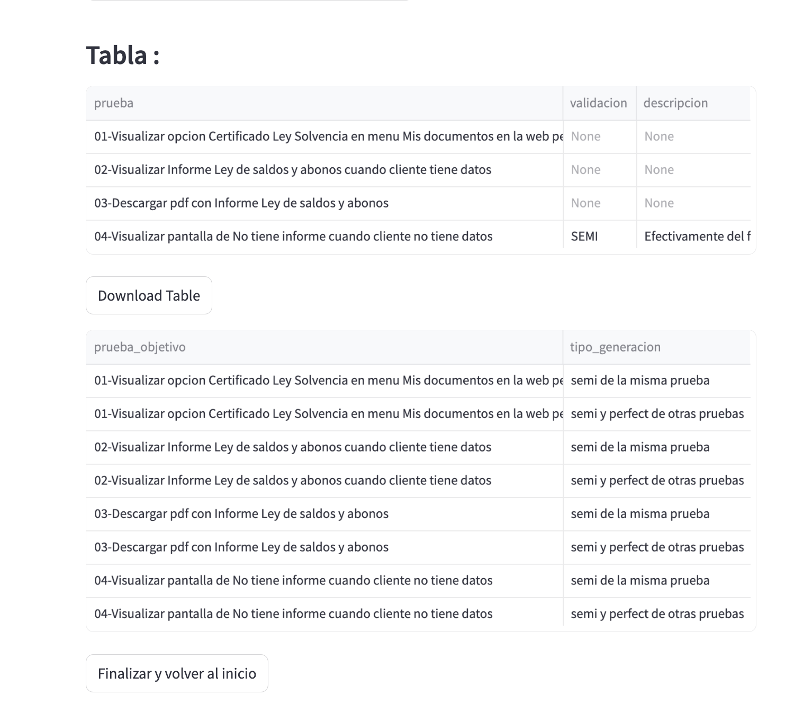

<!-- # Welcome to MkDocs -->

<!-- For full documentation visit [mkdocs.org](https://www.mkdocs.org).

## Commands

* `mkdocs new [dir-name]` - Create a new project.
* `mkdocs serve` - Start the live-reloading docs server.
* `mkdocs build` - Build the documentation site.
* `mkdocs -h` - Print help message and exit.

## Project layout

    mkdocs.yml    # The configuration file.
    docs/
        index.md  # The documentation homepage.
        ...       # Other markdown pages, images and other files. -->

# JIRA : Cómo usar la App

Esta aplicación de Streamlit está diseñada para la consulta de Historias de Usuario y se estructura en tres fases principales: **Inicio**, **Editar** y **Procesar**.

## Fase 1: Inicio

Para comenzar a utilizar la app, selecciona en la barra lateral el motor con el que trabajarás: **JIRA** o **SDM**. Esta elección permite a la aplicación adaptar y visualizar el componente adecuado.

En el caso de JIRA, tendrás la opción de elegir la torre de JIRA que deseas utilizar, la cual se asociará al código JIRA que necesites consultar.

Debajo del cuadro de selección de torre encontrarás:
- Un campo de entrada para ingresar el código JIRA a buscar.
- Un campo de carga de archivos para subir la matriz de pruebas, que se utilizará para encontrar coincidencias.
- Un botón **Enviar** para iniciar el proceso.

## Fase 2: Editar

En esta fase, se muestra la descripción obtenida de JIRA para el código consultado, junto con una tabla editable de componentes funcionales. Una vez revisada y, si es necesario, modificada la tabla, haz clic en **Continuar** para proceder.

## Fase 3: Procesar

Una vez finalizado el procesamiento, la app muestra:
- El historial de scripts Gherkin.
- Las tablas de resultados generados por Gherkin.

Puedes expandir cada script Gherkin para visualizar su código haciendo clic en el expander correspondiente.

Al hacer clic en los expander, se desplegará el código del script:

Finalmente, se muestran las tablas de resultados:

